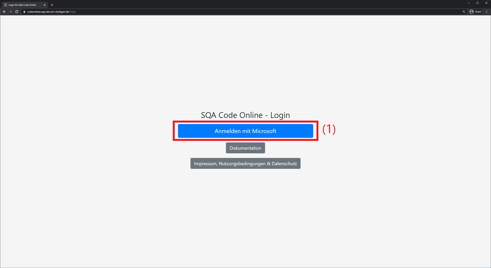

# SQA Code Dokumentation

## Link
- SQA Code Online findet man unter [https://codeonline.sqa.iste.uni-stuttgart.de/](https://codeonline.sqa.iste.uni-stuttgart.de/)

## Anmelden

- Zum Anmelden auf **(1)** klicken  
- Bitte beachten: aus Sicherheitsgründen werden nur mit `@ms.informatik.uni-stuttgart.de` Adressen verknüpfte Accounts unterstützt, private Microsoft Accounts werden nicht unterstützt
- Nach der Anmeldung wird man nach wenigen Sekunden zu SQA Code online umgeleitet

## Ordner öffnen

- Den Dialog um einen Ordner zu öffnen findet man unter Menü **(1)** -> File **(2)** -> Open Folder **(3)**
- Im sich öffnenden Dialog **(4)** kann man nun den gewünschten zu öffnenden Pfad eingeben und mit Enter bestätigen
- Welcher Ordner zu öffnen ist folgt
### Neues Projekt herunterladen (clonen)
- Im [Ordner öffnen Dialog](#Ordner-öffnen) den Ordner `/home/code/` öffnen
- Die Anleitung zum Herunterladen eines Projektes findet sich [hier (siehe 3. Unterpunkt)](#Hamster-Extension)

### Existierendes Projekt öffnen
- Im [Ordner öffnen Dialog](#Ordner-öffnen) den Ordner `/home/code/[Name des Projekts]` öffnen
- Die Autocompletion zeigt mögliche Unterordner an, so kann man auch Projekte öffnen deren Namen man vergessen hat

## Projektspezifische Einstellungen

- Beim Öffnen eines Projekts werden möglicherweise mehrere zu wählende Einstellungen der Java Erweiterung angezeigt
- _Enable Semantic highlighting for Java by default_ **(1)**: **Disable**
- _... Java project setting files ..._ **(2)**: **Exclude globally**

## Projektansicht

- Allgemeine Projekt Ansicht
- Unter **(1)** findet man einen Dateiexplorer, dieser öffnet sich dann als **(2)**
    - Ordner **(3)** erkennt man an einem ">" Symbol (eingeklappter Ordner). Durch einen Mausklick kann man diese ein- / ausklappen
    - Dateien kann man mit einem Einfach- oder Doppelklick öffnen
        - Ein Doppelklick öffnet eine Datei permanent als Tab **(5)**, d.h. selbst wenn man eine andere Datei öffnet bleibt der Tab offen
        - Ein Einfachklick öffnet die Datei temporär als Tab, d.h. wenn man eine andere Datei öffnet schliest sich der Tab von selbst wieder (nützlich wenn man nur schnell mehrere Dateien überfliegen möchte, ohne am Ende 20 Tabs offen zu haben)
- Die Tableiste findet man **(5)**
    - Man kann die Reichenfolge der Tabs mit Drag&Drop verändern
    - Mit einem Linksklick wechselt man zum jeweiligen Tab
    - Mit "x" kann man den jeweiligen Tab schließen
    - Man kann via Drag&Drop auch das Editorfenster vertikal **(7)** oder horinzontal teilen  
    Alternativ findet man diese Funktion auch im Kontextmenü des Tabs, welches man mit einem Rechtsklick öffnet
- Mit **(4)** öffnet man die Hamster-Extension Sidebar, in derm man u.a. den Hamster ausführen kann und ein Projekt herunterladen / speichern, mehr dazu [hier](#Hamster-Extension)
- Befindet sich in einer geöffneten Datei eine `main`-Methode, wird über dieser "Run | Debug" angezeigt **(6)**. Mit "Run" kann man die jeweilige Main-Methode ausführen, was im oben gegebenen Beispiel das `TemplateHamsterGame` starten würde.

## Hamster-Extension

- Allgemeine Extension Ansicht öffnet man bei **(1)**
- Mit _Open Hamster GUI_ **(2)** kann man die [Hamster GUI](#SimpleHamsterGame-ausführen) öffnen. Diese öffnet sich auch automatisch, sobald man ein SimpleHamsterGame startet
- Mit _Download Code from Artemis / GitHub_ **(3)** kann man ein Projekt herunterladen (via git clone), mehr dazu unter [Projekt herunterladen](#Projekt-herunterladen)
- Mit _Save Code to Artemis_ **(4)** kann mein ein Projekt speichern
    - Diese Funktion steht nur zur Verfügung, wenn das Projekt via **(3)** von **Artemis** heruntergeladen wurde
    - In diesem Fall werden jegliche Änderungen nach Artemis gespeichert (und Tests ausgeführt, mehr dazu in der Artemis Erklärung)
- Bei _StartableHamsterGames_ **(5)** findet sich eine Auflistung aller von Klassen, die ausgeführt werden können
    - Durch einen Klick auf einen _Start [...]_ Eintrag kann die zugehörige main-Methode ausgeführt werden. Mehr dazu [hier](#SimpleHamsterGame-ausführen)
    - Diese Auflistung ist nur sichtbar, falls ein Ordner mit einem Projekt geöffnet ist
    - Welche main-Methoden ausgeführt werden können wird durch die Datei `config.json` festgelegt. Es reicht also nicht aus, weitere Klassen mit main-Methode dem Projekt hinzuzufügen
- Unter _Controls_ **(6)** finden sich verschiedene Optionen, ausgeführte SimpleHamsterGames zu steuern, mehr dazu bei [SimpleHamsterGame ausführen](#SimpleHamsterGame-ausführen)
### Projekt herunterladen

- Nach einem Klick auf _Download Code from Artemis / GitHub_ öffnet sich ein Dialog **(1)**, in den man die URL eingeben muss
    - Für GitHub die URL des **öffentlichen** Repositories eingeben (z.B. https://github.com/SQA-PSE-WS2020/exercise-sheet-5) und mit Enter bestätigen, das Projekt wird automatisch heruntergeladen und geöffnet
    - Für Artemis die URL des eigenen **privaten** Repositories eingeben und mit Enter bestätigen. Es öffnet sich ein neuer Tab, in dem man sich mit seinen Artemis Anmeldedaten anmelden muss.
- Hinweis: es ist nicht möglich / sinnvoll ein Projekt in einem anderen Projekt zu speichern. Um ein Projekt herunterladen zu können, sollte deshalb der Ordner `/home/code/` geöffnet werden, siehe hierfür [Ordner öffnen](#Ordner-öffnen)
### SimpleHamsterGame ausführen

- **(1)**: _Resume game_, setzt das game fort, nur möglich wenn game gerade pausiert ist
    - Stellt automatisch alle rückgängig gemachten Schritte der Ausführung wieder her
- **(2)**: _Pause game_, pausiert das game, nur möglich wenn das game gerade läuft
- **(3)**: beendet das aktuelle game
- **(4)**: _Undo_, macht einen Schritt der Ausführung rückgängig, nur möglich wenn das game gestoppt oder pausiert ist (und es noch einen Schritt zum rückgängigmachen gibt)
- **(5)**: _Redo_, stellt einen Schritt der Ausführung wieder her, nur möglich wenn das game gestoppt oder pausiert ist (und es noch einen Schritt zum wiederherstellen gibt)
- **(6)**: Geschwindigkeitsregler, je weiter rechts der Regler, desto schneller wird das game ausgeführt
- **(7)**: _Kill all running games_, beendet alle aktuellen games
    - Prinzipiell können mehr als ein game gleichzeitig ausgeführt werden, meistens ist dies jedoch nicht gewünscht. Dieser Button ist insbesondere deshalb nützlich, um noch vorhandene, aber nicht mehr erwünschte games zu beenden (die sonst die UI für neue games blockieren)
- **(8)**: Hier wird das territory angezeigt
- **(9)**: _Log_, beinhaltet alle Schritte der Ausführung eines games von oben nach unten in der Reihenfolge der Ausführung
    - Mit einem Hamster assoziierte Schritte sind mit einem Hamster-Symbol der passenden Farbe versehen, um sie einem Hamster zuordnen zu können
    - Macht man einen Schritt rückgängig - oder stellt diesen wieder her - sieht man dies auch am Log
- **(10)**: Beenden button der java extension
    - Hiermit kann das aktuell ausgeführt java Programm - was meistens das game ist - beendet werden
    - Dieser Button verschwindet ab und an, ohne dass man etwas dagegen tun kann. In diesem Fall kann man **(3)** oder **(7)** verwenden um ein / alle games zu beenden
